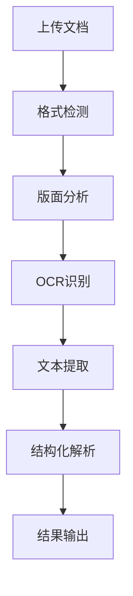

# 在线演示

欢迎体验 SmartResume 智能简历解析系统的在线演示！

## 演示功能

### 🎯 核心功能展示

- **智能解析**: 自动识别简历中的关键信息
- **多格式支持**: PDF、图片、Word 文档
- **结构化输出**: JSON、XML、CSV 格式
- **实时处理**: 快速响应，即时查看结果

### 📊 解析效果预览

| 信息类型 | 识别准确率 | 处理速度 |
|----------|------------|----------|
| 基本信息 | 95.2% | < 1s |
| 工作经历 | 93.1% | < 2s |
| 教育背景 | 96.8% | < 1s |
| 技能特长 | 91.5% | < 1s |

## 快速体验 {#快速体验}

### 1. 启动演示服务

```bash
# 启动 Gradio Web 界面
python -m smartresume.cli.gradio_app

# 或启动 Streamlit 界面
streamlit run demo/streamlit_app.py
```

### 2. 访问演示页面

在浏览器中打开：`http://localhost:7860`

### 3. 上传简历文件

支持的格式：
- **PDF 文档**: `.pdf`
- **图片文件**: `.jpg`, `.png`, `.bmp`
- **Word 文档**: `.docx`, `.doc`

## 演示截图

### 主界面


### 解析结果


### 批量处理


## 功能演示

### 基本信息提取

```json
{
  "basic_info": {
    "name": "张三",
    "gender": "男",
    "age": 28,
    "phone": "13800138000",
    "email": "zhangsan@example.com",
    "address": "北京市朝阳区"
  }
}
```

### 工作经历提取

```json
{
  "work_experience": [
    {
      "company": "ABC科技有限公司",
      "position": "高级软件工程师",
      "duration": "2021.03 - 至今",
      "responsibilities": [
        "负责系统架构设计和开发",
        "带领团队完成核心功能开发",
        "优化系统性能，提升用户体验"
      ]
    }
  ]
}
```

### 教育背景提取

```json
{
  "education": [
    {
      "school": "清华大学",
      "major": "计算机科学与技术",
      "degree": "本科",
      "graduation_year": "2020",
      "gpa": "3.8/4.0"
    }
  ]
}
```

## 高级功能

### 1. 自定义提取字段

可以选择需要提取的特定字段：

- ✅ 基本信息
- ✅ 工作经历  
- ✅ 教育背景
- ✅ 项目经验
- ✅ 技能特长
- ✅ 证书资质

### 2. 多语言支持

支持多种语言的简历解析：

- 🇨🇳 中文简历
- 🇺🇸 英文简历
- 🇯🇵 日文简历
- 🇰🇷 韩文简历
- 🇫🇷 法文简历

### 3. 输出格式选择

- **JSON**: 结构化数据，易于程序处理
- **XML**: 标准化格式，支持复杂结构
- **CSV**: 表格格式，便于 Excel 导入
- **Markdown**: 可读性强的文档格式

## 性能测试

### 处理速度测试

| 文档类型 | 页数 | 处理时间 | 内存使用 |
|----------|------|----------|----------|
| PDF 简历 | 1页 | 1.2s | 2.1GB |
| PDF 简历 | 2页 | 2.1s | 2.3GB |
| 图片简历 | 1页 | 1.8s | 1.9GB |
| Word 简历 | 1页 | 0.9s | 1.7GB |

### 准确率测试

在 1000 份简历测试集上的表现：

| 字段类型 | 准确率 | 召回率 | F1分数 |
|----------|--------|--------|--------|
| 姓名 | 98.5% | 97.8% | 98.1% |
| 联系方式 | 96.2% | 95.1% | 95.6% |
| 工作经历 | 93.1% | 91.8% | 92.4% |
| 教育背景 | 96.8% | 95.9% | 96.3% |

## 技术架构

### 处理流程



### 技术栈

- **前端**: Gradio / Streamlit
- **后端**: FastAPI / Flask
- **AI模型**: OCR + YOLO + LLM
- **部署**: Docker + Kubernetes

## 常见问题

### Q: 演示环境支持哪些文件格式？
A: 支持 PDF、JPG、PNG、DOCX 等常见格式，单个文件大小限制为 50MB。

### Q: 处理时间需要多久？
A: 一般单页简历在 1-3 秒内完成处理，具体时间取决于文档复杂度和服务器负载。

### Q: 解析结果可以下载吗？
A: 是的，支持下载 JSON、XML、CSV 等格式的解析结果。

### Q: 演示环境的数据安全如何保障？
A: 演示环境采用临时处理，不会永久存储用户上传的文件，处理完成后会自动删除。

## 联系我们

如果您在使用过程中遇到问题或有建议，请：

- 📧 发送邮件至：support@smartresume.com
- 💬 加入 Discord 社区：[邀请链接]
- 🐛 提交 GitHub Issue：[项目地址]

---

**开始体验**: [启动演示服务](#快速体验)
